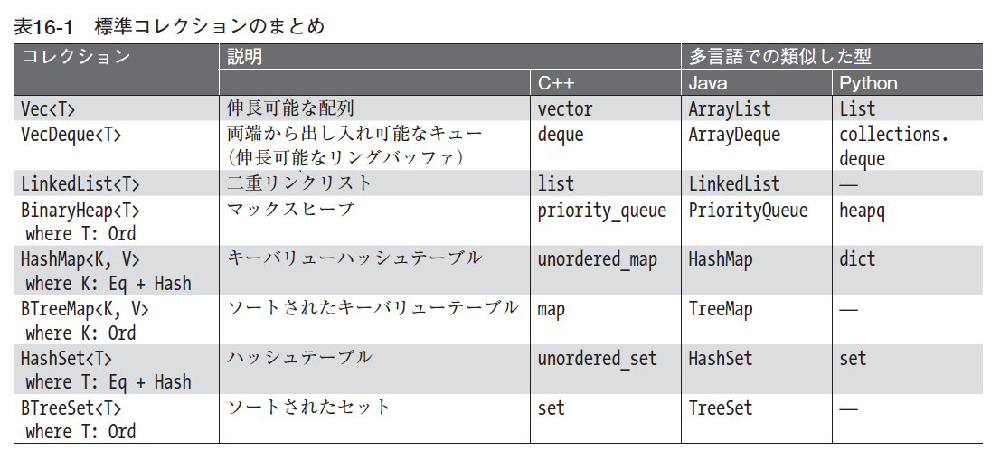
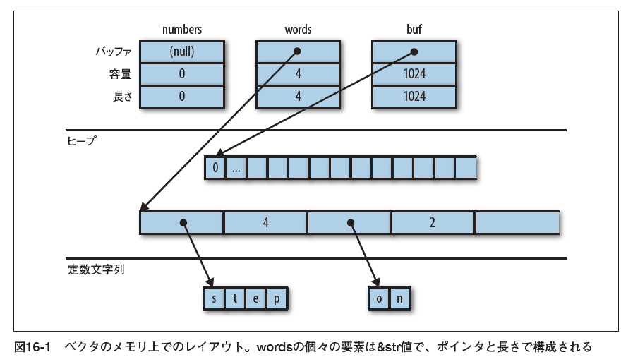

<!-- theme: gaia -->
<!-- size: 16:9 -->
<!-- page_number: true -->
<!-- paginate: true -->

<style>
img[alt~="center"] {
  display: block;
  margin: 0 auto;
}
</style>

# プログラミングRust
16章　コレクション

2021/3/5

---
## 16.1　概要


---
#### 標準コレクションのまとめ1
- `Vec<T>`：可変長な，ヒープ上に確保される型 `T` の配列．
- `VecDeque<T>`：FIFO (first-in-first-out：先入れ先出し) キューにはこちらの方が適している．
このコレクションは末尾だけでなく先頭に値を追加・削除できるため，他の操作は少しだけ遅い．
- `LinkedList<T>`：`VecDeque<T>` と同様に先頭と末尾に高速にアクセスでき，高速に連結することもできる．
ただし，一般に `LinkedList<T>` は `Vec<T>` や `VecDeque<T>` よりも遅い．

---
#### 標準コレクションのまとめ2
- `BinaryHeap<T>`：順序付きのキュー．
`BinaryHeap` 内の値は常に，効率良く最大値を見つけて取り出せるように構成されている．
- `HashMap<K, V>`：キーと値のペアからなるテーブル．
キーによる値の検索は高速だが，エントリの順番は保証されない．
- `BTreeMap<K, V>`：`HashMap<K, V>` に似ているが，エントリをキーの順番でソートした状態に保つ．
例えば，`BTreeMap<String, i32>` は `String` 値を比較した順でエントリを並べる．
エントリをソートしておく必要がないなら，`HashMap` の方が高速．

---
#### 標準コレクションのまとめ3
- `HashSet<T>`：型 `T` の集合．
高速に値を追加・削除でき，ある値が集合に含まれているかどうかを高速に判定することができる．
- `BTreeSet<T>`：`HashSet<T>` に似ているが．要素を値の順に保つ．データをソートしておく必要がなければ，`HashSet` の方が高速．

---
## 16.2　`Vec<T>`
ベクタを作る最も簡単な方法は，`vec!` マクロを使う方法だ．
```rust
// 空のベクタを作る
let mut numbers: Vec<i32> = vec![];

// 与えた内容でベクタを作る
let words = vec!["step", "on", "no", "pets"];
let mut buffer = vec![0u8; 1024];
```

---
#### ベクタの3つのフィールド


---
#### イテレータからのベクタの作成
- 他のコレクションと同様，`Vec` は `std::iter::FromIterator` を実装しているため，イテレータの `.collect()` メソッドを用いて任意のイテレータからベクタを作ることができる．
```rust
// 他のコレクションからベクタへの変換
let my_vec = my_set.into_iter().collect::<Vec<String>>();
```

---
### 16.2.1　要素へのアクセス
- インデックスが範囲外を指していたらパニックを起こす．
```rust
// 要素への参照を取得
let first_line = &lines[0];

// 要素のコピーを取得
let fifth_number = numbers[4];        // コピーを要求
let second_line = lines[1].clone();   // クローンを要求

// スライスへの参照を取得
let my_ref = &buffer[4..12];

// スライスのコピーを取得
let my_copy = buffer[4..12].to_vec();  // クローンを要求
```

---
#### ベクタの長さとインデックスの型
- Rustは数値型に対して神経質だが，ベクタも例外ではない．
- ベクタの長さとインデックスの型は `usize` でなければならない．
- 必要ならキャスト `n as usize` を用いるとよい．

---
#### アクセスメソッド1
- `slice.first()`：`slice` に最初の要素があれば，その要素への参照を返す．
返り値の型は `Option<&T>` で，`slice` が空なら `None` を，空でなければ `Some(&slice[0])` を返す．
```rust
if let Some(item) = v.first() {
    println!("We got one! {}", item);
}
```
- `slice.last()`：`first` と同様に，最後の要素への参照を返す．

---
#### アクセスメソッド2
- `slice.get(index)`：`slice[index]` が存在すれば，その値への参照を `Some` で包んで返す．
`slice` の要素数が `index + 1` よりも少なかった場合には `None` を返す．
```rust
let slice = [0, 1, 2, 3];
assert_eq!(slice.get(2), Some(&2));
assert_eq!(slice.get(4), None);
```

---
#### アクセスメソッド3
- `slice.first_mut()`，`slice.last_mut()`，`slice.get_mut(index)`
：変更可能参照を借用して返す．
`T` 型の値を値として返すと移動になるため，要素にアクセスするメソッドは一般に要素への参照を返す（`.to_vec()` メソッドは例外）．
```rust
let mut slice = [0, 1, 2, 3];
{
    let last = slice.last_mut().unwrap();  // lastの型は&mut i32
    assert_eq!(*last, 3);
    *last = 100;
}
assert_eq!(slice, [0, 1, 2, 100]);
```

---
#### アクセスメソッド4
- `slice.to_vec()`：スライス全体を複製し，新しいベクタを返す．
このメソッドは，要素がクローン可能な場合（`where T: Clone` の場合）にだけ使用できる．
```rust
let v = [1, 2, 3, 4, 5, 6, 7, 8, 9];
assert_eq!(v.to_vec(),
           vec![1, 2, 3, 4, 5, 6, 7, 8, 9]);
assert_eq!(v[0..6].to_vec(),
           vec![1, 2, 3, 4, 5, 6]);
```

---
### 16.2.2　イテレート処理
- `Vec<T>` 上のイテレートは，型 `T` のアイテムを生成する．
アイテムはベクタから1つずつ移動され，消費される．
- `&[T; N]`，`&[T]`，`&Vec<T>`（配列，スライス，ベクタへの参照）に対するイテレートは，型 `&T` のアイテム（個々の要素）に対する参照を生成する．
値は移動されない．
- `&mut [T; N]`，`&mut [T]`，`&mut Vec<T>` 型の値に対するイテレートは，`&mut T` 型のアイテムを生成する．

---
### 16.2.3　ベクタの伸長と縮小
- `slice.len()`：`slice` の長さを `usize` で返す．
- `slice.is_empty()`：`slice` に要素が1つもない場合
（`slice.len() == 0` の場合）に真になる．
- 以下のメソッドは，ベクタを伸長・縮小する．
配列やスライスは一度作成したら長さを変えられないため，これらは配列やスライスでは使えない．

---
#### 容量を明示的に管理するメソッド1
- `Vec::with_capacity(n)`：容量 `n` の空のベクタを生成する．
- `vec.capacity()`：`vec` の容量を `usize` で返す．
`vec.capacity() >= vec.len()` は常に成り立つ．
- `vec.reserve(n)`： 少なくとも `n` 個の要素を追加できる容量を確保する．
つまり，`vec.capacity()` が少なくとも `vec.len() + n` 以上になるようにする．
既に十分な余裕があれば何もせず，余裕がなければより大きなバッファを確保し，ベクタの内容をそこにコピーする．

---
#### 容量を明示的に管理するメソッド2
- `vec.reserve_exact(n)`：`vec.reserve(n)` と似ているが，将来の成長に備えた余分な容量を `n` 個以上確保しないようにする．
このメソッドを呼び出したあとは，`vec.capacity()` は `vec.len() + n` と等しくなる．
- `vec.shrink_to_fit()`：`vec.capacity()` が `vec.len()` より大きければ，余分なメモリの解放を試みる．

---
#### 末尾に対して値を追加・削除するメソッド
- `vec.push(value)`：指定した `value` を `vec` の末尾に追加する．
引数は値で受け取る．
- `vec.pop()`：最後の要素を削除して返す．
返り値の型は `Option<T>`．
取り出した値が `x` ならば `Some(x)` を返し，ベクタが既に空だった場合には `None` を返す．
返り値は値で返す．

---
#### 任意の場所対して値を追加・削除するメソッド
- `vec.insert(index, value)`：指定した `value` を `vec[index]` に挿入する．
`vec[index..]` にあった値を1つずつ右にずらして挿入するための隙間を作る．
`index > vec.len()` であればパニックを起こす．
- `vec.remove(index)`：`vec[index]` を削除して返す．
`vec[index+1..]` にあった値を1つずつ左にずらして空いたギャップを埋める．
`index >= vec.len()` であればパニックを起こす．

---
#### 長さを特定の値に変更するメソッド
- `vec.resize(new_len, value)`：`vec` の長さを `new_len` にする．
`vec` の長さが伸びる場合には，`value` を使って新たな空きを埋める.
要素の型は `Clone` トレイトを実装していなければならない．
- `vec.truncate(new_len)`：`vec` の長さを減らして `new_len` にする．
`vec[new_len..]` にあった要素はすべてドロップされる．
`vec.len()` が `new_len` 以下であれば何もしない．
- `vec.clear()`：`vec` のすべての要素を削除する．
`vec.truncate(0)` と等価．

---
#### 多数の値を一度に追加・削除するメソッド1
- `vec.extend(iterable)`：指定された `iterable` から取得できるアイテムをすべて，`vec` の末尾に順番に追加する．
引数 `iterable` は，`IntoIterator<Item=T>` を実装する任意の値となる．
このメソッドはとても有用なので，このメソッドのための標準トレイト `Extend` が用意されており，すべての標準ライブラリのコレクションはこのトレイトを実装している．

---
#### 多数の値を一度に追加・削除するメソッド2
- `vec.split_off(index)`：`vec.truncate(index)` に似ているが，`vec` の末尾から削除された値を格納したVec<T> を返す．
- `vec.append(&mut vec2)`：`vec2` の要素をすべて `vec` に移動する．
実行後には，`vec2` は空になる．
このメソッドは `vec.extend(vec2)` に似ているが，`append` の場合は実行後も `vec2` は存在し容量もそのままだ．
- `vec.drain(range)`：`vec` から `vec[range]` の範囲を削除し，削除した要素に対するイテレータを返す．
`range` は範囲を示し，`..` や `0..4` などになる．

---
#### 要素を選択的に削除する変わり者のメソッド1
- `vec.retain(test)`：`test` にパスしなかったすべての要素を削除する．
引数 `test` は `FnMut(&T) -> bool` を実装する関数もしくはクロージャだ．`vec` の個々の要素に対して `test(&element)` を呼び出し，結果が `false` ならばその要素をベクタから削除してドロップする．
性能の点を除けば，これは下のように書くのと同じ．
```rust
vec = vec.into_iter().filter(test).collect();
```

---
#### 要素を選択的に削除する変わり者のメソッド2
- `vec.dedup()`：繰り返し現れる要素をドロップする．
これはUnixのシェルユーティリティコマンドuniqと似ている．
`vec` をスキャンして同じ値が連続している部分を見つけると，余分な値をドロップし値を1つだけ残す．
```rust
let mut byte_vec = b"Misssssssissippi".to_vec();
byte_vec.dedup();
assert_eq!(&byte_vec, b"Misisipi");
```

---
#### 要素を選択的に削除する変わり者のメソッド3
- 完全に重複を排除したければ，3つ方法がある
    - `.dedup()` を呼ぶ前にベクタをソートする．
    - データを `HashSet` などのセットに入れる．
    - 元の順番を維持したいなら，以下のように `.retain()` を使う．
```rust
let mut byte_vec = b"Misssssssissippi".to_vec();
let mut seen = HashSet::new();
byte_vec.retain(|r| seen.insert(*r));
assert_eq!(&byte_vec, b"Misp");
```

---
#### 要素を選択的に削除する変わり者のメソッド4
- `vec.dedup_by(same)`：`vec.dedup()` とほぼ同じだが，2つの要素が等しいかどうかを判断する際に `==` 演算子ではなく，`same(&mut elem1, &mut elem2)` という形の関数もしくはクロージャを用いる．
- `vec.dedup_by_key(key)`：`vec.dedup()` とほぼ同じだが，`key(&mut elem1) == key(&mut elem2)` であれば，2つの要素 `elem1` と `elem2` が等しいとする．
```rust
// 冗長なメッセージのエラーを削除する．
errors.dedup_by_key(|err| err.description().to_string());
```

---
### 16.2.4　連結
- `slices.concat()`：すべてのスライスをつなげた新たなベクタを返す．
```rust
assert_eq!([[1, 2], [3, 4], [5, 6]].concat(),
           vec![1, 2, 3, 4, 5, 6]);
```
- `slices.join(&separator)`：スライスとスライスの間に `separator` 値のコピーを挟む．
```rust
assert_eq!([[1, 2], [3, 4], [5, 6]].join(&0),
           vec![1, 2, 0, 3, 4, 0, 5, 6]);
```

---
### 16.2.5　分割
- 配列やスライスやベクタの要素に対して，複数の `mut` 参照を得るのはそれほど簡単ではない．
```rust
let mut v = vec![0, 1, 2, 3];
let a = &mut v[i];
let b = &mut v[j];  // エラー: vの変更可能参照を2度以上借用することはできない
```
- これは，`i == j` の場合に `a` と `b` が同じ整数に対する `mut` 参照になってしまい，Rustの安全性ルールに違反するため．

---
#### 2つ以上の部分から変更可能参照を借用するメソッド1
- データを重複のない領域に分割するように設計されているため安全．
- 共有スライスで使うのにも便利なため，可変参照用のメソッドと共有参照用のメソッドそれぞれ用意されている．
- 以下のメソッドはいずれも配列，スライス，ベクタを変更することはなく，内部データの一部への新たな参照を返すだけ．

---
#### 2つ以上の部分から変更可能参照を借用するメソッド2
- `slice.iter()`，`slice.iter_mut()`：`slice` の個々の要素への参照を生成する．
- `slice.split_at(index)`，`slice.split_at_mut(index)`：スライスを2つに分けて，それらのペアを返す．
`slice.split_at(index)` は，`(&slice[..index], &slice[index..])` と等価．
`index` が範囲外だった場合には，パニックになる．

---
#### 2つ以上の部分から変更可能参照を借用するメソッド3
- `slice.split_first()`，`slice.split_first_mut()`：最初の要素 `slice[0]` への参照と，残りの `slice[1..]` への参照のペアを返す．
返り値の型は `Option<(&T, &[T])>` であり，スライスが空の場合には結果が `None` になる．
- `slice.split_last()`，`slice.split_last_mut()`：最初の要素ではなく最後の要素を切り離す．
返り値の型は `Option<(&[T], &T)>`．

---
#### 2つ以上の部分から変更可能参照を借用するメソッド4
- `slice.split(is_sep)`，`slice.split_mut(is_sep)`： `slice` を1つ以上のサブスライスに分割する．
返り値のイテレータを消費すると，スライスの個々の要素に対して `is_sep(&element)` が呼び出され，`is_sep(&element)` が `true` の場合はその要素がセパレータとなる．
セパレータはどのサブスライスにも含まれない．
出力には最低でも1つのサブスライスが含まれ，1つのセパレータごとに1つのサブスライスが追加される．
セパレータが連続している場合や，`slice` の最後のアイテムがセパレータであった場合は，結果に空のサブスライスが含まれる．

---
#### 2つ以上の部分から変更可能参照を借用するメソッド5
- `slice.splitn(n, is_sep)`，`slice.splitn_mut(n, is_sep)`：最大でも `n` 個のサブスライスしか作らない．
`n - 1` 個のスライスが見つかった後は `is_sep` は呼び出されない．
- `slice.rsplitn(n, is_sep)`，`slice.rsplitn_mut(n, is_sep)`：スライスを逆順にスキャンする．
最後の `n - 1` 個のセパレータでスライスを分割する．
- `slice.chunks(n)`，`slice.chunks_mut(n)`：長さ `n` の重複しないサブスライスのイテレータを返す．
`slice.len()` が `n` の倍数でない場合，最後のサブスライスは `n` よりも短くなる．

---
#### 2つ以上の部分から変更可能参照を借用するメソッド6
- `slice.windows(n)`：`slice` のデータ上でスライディングウィンドウのように振る舞うイテレータを返す．
`n` が `slice` の長さより大きかった場合にはスライスは1つも作られず，`n == 0` ならパニックを起こす．
```rust
let changes = daily_high_temperatures
              .windows(2)            // 連続した2日の温度を取得
              .map(|w| w[1] - w[0])  // どのくらい変動した？
              .collect::<Vec<_>>();
```
- サブスライスが重なり合っているので，このメソッドには `mut` 参照を返すバージョンはない．

---
### 16.2.6　入れ替え
- `slice.swap(i, j)`：`slice[i]` と `slice[j]` を入れ替える．
- `vec.swap_remove(i)`：`vec[i]` を削除し，返す．
`vec.remove(i)` と似ているが，ベクタの残りの部分をスライドしてギャップを埋めるのではなく，`vec` の最後の要素を移動してきてギャップを埋める．
ベクタに残される要素の順番を気にしないで良い場合に有用．

---
### 16.2.7　ソートと検索
- `slice.sort()`：要素を昇順にソートする．
要素の型が `Ord` を実装している場合にだけ使える．
- `slice.sort_by(cmp)`：ソートに用いる順序を，関数もしくはクロージャ `cmp` を用いて指定する．
`cmp` は `Fn(&T, &T) -> std::cmp::Ordering` を実装していなければならない．
```rust
students.sort_by(|a, b| a.last_name.cmp(&b.last_name));
students.sort_by(|a, b| {
    let a_key = (&a.last_name, &a.first_name);
    let b_key = (&b.last_name, &b.first_name);
    a_key.cmp(&b_key)
});
```

---
#### `sort_by_key` 1
- `slice.sort_by_key(key)`：`slice` の要素を関数もしくはクロージャ `key` を用いて得られたソートキーの昇順でソートする．
`key` は `Fn(&T) -> K where K: Ord` を実装している必要がある．
```rust
// 点数の平均点でソート．低い点から．
students.sort_by_key(|s| s.grade_point_average());
```
- ソートキーの値はソートの際にキャッシュされないので，`key` 関数は `n` 回以上呼び
出されるかもしれない．

---
#### `sort_by_key` 2
- 技術的な理由から，`key(element)` は要素から借用した参照を返すことができない．
```rust
students.sort_by_key(|s| &s.last_name);  // エラー: 生存期間を推論できない
```
- Rustが生存期間を推論できないため．
- この場合には，単に `.sort_by()` を使えばよい．

---
#### 逆順のソート
- 逆順にソートするには，`sort_by` を2つの引数の順番を入れ替えた `cmp` で呼び出せばよい．
- 引数を `|a, b|` ではなく `|b, a|` にすれば，逆順になる．
- 単にソートした後で `.reverse()` を呼び出して逆順にしてもよい．

---
#### 二分検索
- `slice.binary_search(&value)`，`slice.binary_search_by(&value, cmp)`，`slice.binary_search_by_key(&value, key)`：ソートされている `slice` から `value` を検索する．
返り値の型は `Result<usize, usize>`．
指定されたソート順で `slice[index]` が `value` に等しければ `Ok(index)` を返し，そのような `index` がない場合には `Err(insertion_point)` を返す．
二分探索がうまく機能するのは，スライスが指定した順にソートされている場合だけ．

---
#### ソートされていないベクタの検索
- `slice.contains(&value)`：`slice` の要素のいずれかが `value` と等しければ `true` を返す．
スライス内での値の位置を探すには，JavaScriptの `array.indexOf(value)` のように，イテレータを使う．
```rust
slice.iter().position(|x| *x == value)
```
- 返り値は `Option<usize>`．


